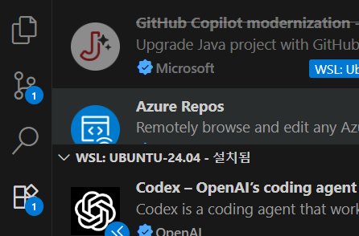
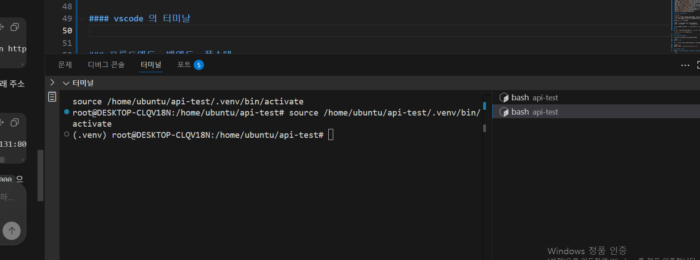
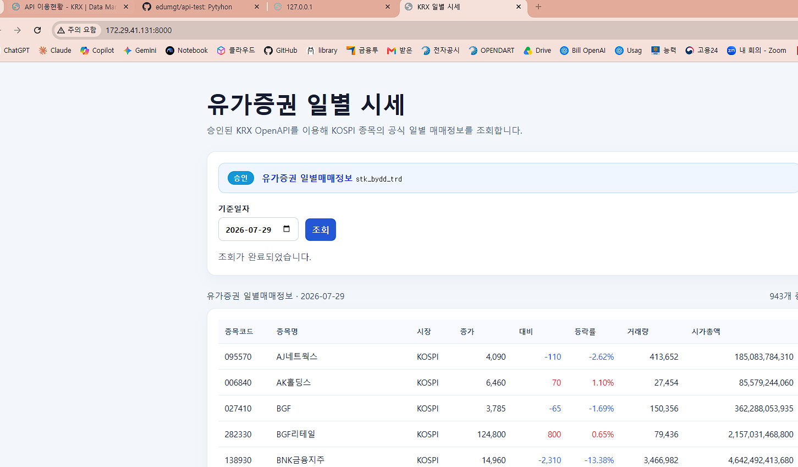
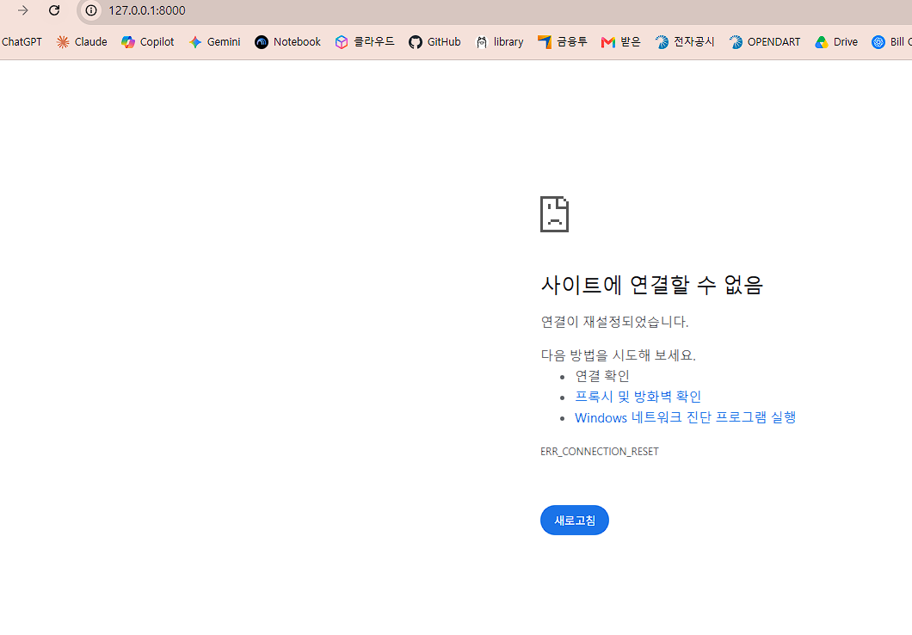
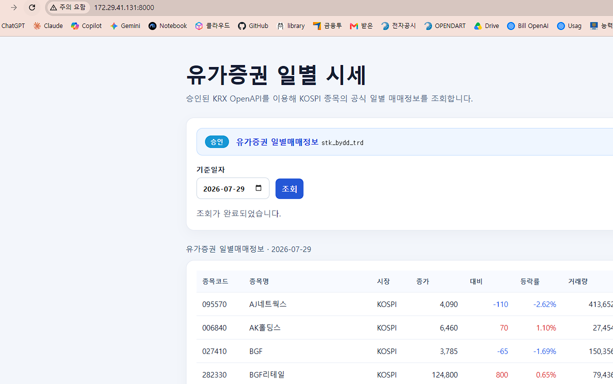
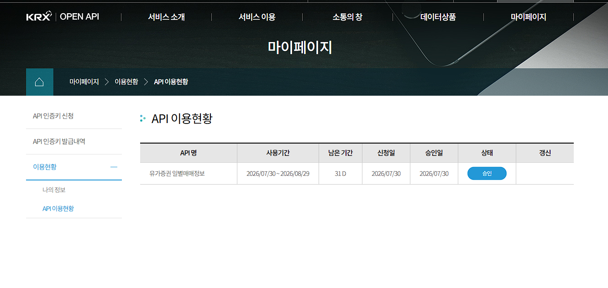

# 금주 IT 관련 용어, 솔루션 정리

## 주요 솔루션 공식 URL

| 솔루션 | 공식 사이트 또는 문서 |
| --- | --- |
| Markdown | [Markdown Guide](https://www.markdownguide.org/) |
| VS Code | [code.visualstudio.com](https://code.visualstudio.com/) |
| Claude Code | [Claude Code Docs](https://code.claude.com/docs/en/overview) |
| OpenAI Codex | [Codex 공식 문서](https://developers.openai.com/codex/) |
| AWS | [aws.amazon.com](https://aws.amazon.com/) |
| Google Cloud (GCP) | [cloud.google.com](https://cloud.google.com/) |
| Microsoft Azure | [azure.microsoft.com](https://azure.microsoft.com/) |
| WSL | [Microsoft WSL 문서](https://learn.microsoft.com/windows/wsl/) |
| Ubuntu | [ubuntu.com](https://ubuntu.com/) |
| FastAPI | [fastapi.tiangolo.com](https://fastapi.tiangolo.com/) |
| Uvicorn | [uvicorn.org](https://www.uvicorn.org/) |
| ApexCharts | [apexcharts.com](https://apexcharts.com/) |
| Git | [git-scm.com](https://git-scm.com/) |
| GitHub | [github.com](https://github.com/) |

## IT 기초 용어

### [Markdown](https://www.markdownguide.org/) (`.md`)

Markdown은 문서를 간단한 기호로 작성하는 방식입니다. 확장자가 `.md`인 파일에 주로 사용하며, GitHub나 VS Code에서 보기 좋게 표시됩니다.

```md
# 가장 큰 제목
## 한 단계 작은 제목
- 목록 항목
```

`#`의 개수가 적을수록 더 큰 제목입니다. 이 README도 Markdown으로 작성되어 있습니다.

### [VS Code](https://code.visualstudio.com/)

**Visual Studio Code(VS Code)**는 Microsoft가 제공하는 무료 코드 편집기입니다. 파일을 열고 수정하는 기능뿐 아니라 다음 작업을 한곳에서 할 수 있습니다.

- 프로젝트 파일 탐색
- 코드 안의 단어 검색
- Git을 이용한 변경 이력 관리
- 확장 프로그램 설치
- 내장 터미널에서 명령 실행



### AI 코딩 에이전트: [Claude Code](https://code.claude.com/docs/en/overview)와 [Codex](https://developers.openai.com/codex/)

Claude Code와 Codex는 개발 작업을 돕는 AI 에이전트입니다. VS Code나 터미널과 연결하면 현재 프로젝트 파일을 바탕으로 코드 설명, 수정, 오류 확인 같은 일을 도울 수 있습니다.

웹 브라우저에서 AI와 대화하는 것과 달리, 개발 도구에 연결하면 필요한 파일을 직접 참고하며 작업할 수 있어 복사·붙여넣기가 줄어듭니다. 서비스별로 계정, 사용 가능 지역, 요금 정책은 다를 수 있습니다.

### 클라우드와 CSP

**CSP(Cloud Service Provider)**는 서버, 저장 공간, 데이터베이스 같은 컴퓨팅 자원을 인터넷으로 빌려 주는 회사입니다. 대표적으로 [AWS](https://aws.amazon.com/)(Amazon), [Google Cloud](https://cloud.google.com/)(GCP), [Microsoft Azure](https://azure.microsoft.com/)가 있습니다.

직접 컴퓨터를 구매·관리하는 대신, 필요한 만큼만 서버를 만들고 사용량에 따라 비용을 내는 방식입니다. 웹 화면에서 자원을 관리하는 곳은 보통 **콘솔(Console)**, 터미널 명령으로 관리하는 방식은 **CLI(Command Line Interface)**라고 합니다.

### VM, [WSL](https://learn.microsoft.com/windows/wsl/), [Ubuntu](https://ubuntu.com/)

- **VM(Virtual Machine, 가상 머신)**: 한 대의 실제 컴퓨터 안에 소프트웨어로 만든 또 하나의 컴퓨터입니다. 클라우드 서버에서 널리 사용됩니다.
- **WSL(Windows Subsystem for Linux)**: Windows에서 Linux 명령과 개발 환경을 사용할 수 있게 해 주는 기능입니다.
- **Ubuntu**: 많이 사용하는 Linux 운영체제 중 하나입니다.

처음부터 Linux 명령어를 외울 필요는 없습니다. 자주 쓰는 명령부터 사용하며 익히고, 필요할 때 공식 문서나 AI의 도움을 받아 확인하는 편이 효율적입니다.

#### vscode 의 터미날 - 각각 리눅스에 별도 접속 하는 역할



### 프론트엔드, 백엔드, 풀스택

| 구분 | 쉬운 설명 | 이 프로젝트에서의 예 |
| --- | --- | --- |
| 프론트엔드(FE) | 사용자가 보는 화면과 버튼, 표를 만드는 부분 | `index.html` |
| 백엔드(BE) | 화면 뒤에서 데이터와 규칙을 처리하는 부분 | `main.py` |
| 풀스택 | 프론트엔드와 백엔드를 모두 다루는 개발 방식 또는 개발자 | 화면과 서버를 함께 수정 |

예를 들어 “백엔드는 Python으로, 프론트엔드는 바닐라 JavaScript로 만들어 줘”라고 요청할 수 있습니다. 여기서 바닐라 JavaScript는 별도 프레임워크 없이 기본 JavaScript를 사용한다는 뜻입니다.

### API, JSON, REST

**API(Application Programming Interface)**는 프로그램끼리 정보를 요청하고 전달하는 약속입니다. 식당에 비유하면, 메뉴를 받아 주방에 주문을 전달하고 음식을 가져오는 직원과 비슷합니다.

- **JSON**: 데이터를 `"이름": "값"` 형태로 정리하는 표준 형식입니다.
- **REST API**: 웹 주소와 HTTP 요청 방식을 이용해 데이터를 주고받는 API 설계 방식입니다.
- **HTTP 메서드**: 요청의 목적을 나타내는 단어입니다. `GET`은 조회, `POST`는 생성, `PUT`/`PATCH`는 수정, `DELETE`는 삭제에 주로 사용합니다.
- **OPTIONS**: 브라우저가 실제 요청 전에 서버에 허용 여부를 확인할 때 주로 쓰는 메서드입니다.
- **CORS**: 다른 웹사이트가 내 서버의 API를 브라우저에서 호출할 수 있는 범위를 정하는 보안 규칙입니다. 모든 요청을 막는 기능이 아니라, 허용할 출처를 정하는 기능에 가깝습니다.

### 데이터 시각화

데이터 시각화는 숫자나 표를 차트·그래프 등으로 바꾸어 흐름을 빠르게 이해하도록 돕는 방법입니다. 프론트엔드에서는 [ApexCharts](https://apexcharts.com/) 같은 차트 라이브러리를 사용할 수 있습니다. 데이터가 무엇을 의미하는지 확인한 뒤, 목적에 맞는 차트를 고르는 것이 중요합니다.

### [Git](https://git-scm.com/)과 [GitHub](https://github.com/)

- **Git**: 코드와 문서의 변경 이력을 기록하고 되돌릴 수 있게 해 주는 버전 관리 도구입니다.
- **GitHub**: Git 저장소를 온라인에 보관하고 팀원과 공유하는 서비스입니다.
- **저장소(Repository, Repo)**: 프로젝트 파일과 변경 이력을 담는 공간입니다.
- **브랜치(Branch)**: 원본 작업에 영향을 주지 않고 기능을 따로 개발할 수 있는 작업 줄기입니다.

GitHub 저장소를 처음 내려받을 때는 `git clone 저장소_주소`를 사용합니다. Git에 변경 기록을 남기려면 이름과 이메일도 설정합니다.

```bash
git config --global user.name "Your Name"
git config --global user.email "your_email@example.com"
git clone 저장소_주소
```

공개 저장소(Public)는 누구나 볼 수 있고, 비공개 저장소(Private)는 권한을 받은 사람만 볼 수 있습니다. 인증키, 비밀번호, 개인 정보는 저장소에 올리지 않아야 합니다.

### IP 주소와 포트

웹 주소 `http://127.0.0.1:8000`에는 두 가지 정보가 들어 있습니다.

| 요소 | 비유 | 의미 |
| --- | --- | --- |
| IP 주소 (`127.0.0.1`) | 건물의 주소 | 어느 컴퓨터로 갈지 나타냅니다. |
| 포트 (`8000`) | 건물 안의 호수 또는 내선번호 | 그 컴퓨터의 어떤 프로그램으로 갈지 나타냅니다. |

하나의 컴퓨터에서는 여러 서버 프로그램이 동시에 실행될 수 있습니다. 포트 번호가 다르면 같은 컴퓨터에서도 서로 다른 프로그램에 연결할 수 있습니다. `127.0.0.1`은 내 컴퓨터를 뜻하는 특별한 IP 주소입니다.

## 기술스택
### 현대 프로그래밍은 혼자 모든 로직과 SW 를 개발하지 않습니다. 이미 있는거, 유명해진 SW 를 조합 합니다.
### 클라우드는 그러한 유명한 오픈소스를 리소스로 개발해서 서비스 합니다. AI 관련 모델도 전부 클라우드를 통해 서빙 됩니다.
### 기술스택은 이러한 소프트웨어의 종류를 나열한 목록 입니다.
### wishket.com 을 가입하고 로그인 해서, 취업 및 실무에서 어떤 기술 스택을 요구 하는지 같이 보겠습니다.
### github 의 채널로는 https://github.com/stacksimplify 가 유명 합니다.

---
---

# KRX 일별 시세 조회 예제

## KOSIS 공지사항 RSS 읽기

`kosis_rss.py`는 KOSIS가 제공하는 공지사항 RSS를 읽는 독립 실행 스크립트입니다. 별도 패키지 설치 없이 Python 표준 라이브러리만 사용합니다.

```bash
# 최근 공지 10건을 콘솔에 표시
python3 kosis_rss.py

# 최근 5건을 JSON으로 표시
python3 kosis_rss.py --limit 5 --json

# RSS 전체 결과를 JSON 파일로 저장
python3 kosis_rss.py --output kosis_notices.json
```

RSS 원본: https://kosis.kr/rss/notice_rss.jsp

이 프로젝트는 KRX OpenAPI에서 **유가증권 일별매매정보**를 받아 웹 화면에 표시하는 작은 예제입니다. Python으로 만든 서버가 KRX에 데이터를 요청하고, 브라우저는 그 결과를 표로 보여 줍니다.

> 인증키는 서버에서만 사용합니다. 따라서 화면이나 GitHub 저장소에 키가 노출되지 않도록 구성되어 있습니다.


## 프로젝트 구성과 동작 방식

| 파일 | 역할 |
| --- | --- |
| `main.py` | FastAPI 서버입니다. KRX에 요청하고 그 결과를 브라우저에 전달합니다. |
| `index.html` | 종목 시세를 화면에 표시하는 웹 페이지입니다. |
| `.key` | KRX 인증키를 보관하는 로컬 파일입니다. Git에 올리지 않습니다. |

데이터는 다음 순서로 이동합니다.

```text
브라우저 → 이 프로젝트의 FastAPI 서버 → KRX OpenAPI
브라우저 ← 시세 데이터             ← KRX OpenAPI 응답
```

브라우저가 KRX에 직접 요청하지 않고 서버를 거치는 이유는 인증키를 안전하게 보호하기 위해서입니다.

## 화면

기준일을 선택하면 KOSPI 종목의 종가, 전일 대비, 등락률, 거래량, 시가총액을 확인할 수 있습니다.



## 실행 방법

### 1. 필요한 프로그램 확인

Ubuntu 또는 WSL 터미널에서 Python 버전을 확인합니다.

```bash
python3 --version
```

처음 개발 환경을 준비하는 경우에는 아래 패키지를 설치합니다.

```bash
sudo apt update
sudo apt install -y python3-pip python3-venv git curl
```

### 2. 가상환경 만들기

가상환경은 **이 프로젝트에 필요한 Python 패키지를 다른 프로젝트와 분리해 보관하는 전용 상자**입니다.

```bash
python3 -m venv .venv
source .venv/bin/activate
```

터미널 앞에 `(.venv)`가 표시되면 활성화된 상태입니다. 작업을 마칠 때는 `deactivate`로 빠져나올 수 있습니다.

### 3. 라이브러리 설치 및 서버 실행

```bash
pip install fastapi "uvicorn[standard]"
uvicorn main:app --reload
```

`--reload`는 `main.py`를 저장할 때 서버를 자동으로 다시 시작하는 개발용 옵션입니다.

같은 컴퓨터에서 실행했다면 브라우저에서 아래 주소를 엽니다.

```text
http://127.0.0.1:8000/
```

## 본인 실행 웹이 보이지 않는 다면

## wsl 과 윈도우즈 호스트(내가 사용하는 윈도우즈) 간의 네트웍 분리현상이 있을 수 있음
## wsl 사용 고유 가상 IP 로 실행


## KRX 인증키 설정

먼저 KRX OpenAPI에서 **유가증권 일별매매정보 (`stk_bydd_trd`)** 이용을 신청하고 승인을 받아야 합니다.



인증키는 다음 두 방법 중 하나로 설정합니다.

### 방법 1: `.key` 파일 사용

프로젝트 최상위 폴더에 `.key` 파일을 만들고, 발급받은 키를 한 줄로 입력합니다.

```text
발급받은_인증키
```

`.key`는 `.gitignore`에 포함되어 있으므로 GitHub에 업로드되지 않습니다. 인증키를 코드, README, 화면에 붙여 넣지 마세요.

### 방법 2: 환경 변수 사용

```bash
export KRX_AUTH_KEY='발급받은_인증키'
```

이 설정은 현재 터미널에서만 유지됩니다. 새 터미널을 열면 다시 설정해야 할 수 있습니다.

인증키가 없거나 API 이용 승인이 만료된 경우 화면에 오류 안내가 표시됩니다. KRX에서 `401` 또는 `403` 오류가 반환되면 API의 이용 기간과 승인 상태를 확인하세요.

## API 사용 방법

서버는 아래 주소로 시세 데이터를 제공합니다.

```text
GET /api/krx/stocks?bas_dd=YYYYMMDD
```

예를 들어 2026년 7월 31일 데이터를 요청하려면 다음 주소를 사용합니다.

```text
http://127.0.0.1:8000/api/krx/stocks?bas_dd=20260731
```

`bas_dd`는 기준일이며 `YYYYMMDD` 형식으로 입력합니다. 날짜를 생략하면 서버는 기본적으로 전날을 조회하며, 주말에는 직전 금요일을 사용합니다. 공휴일에는 해당 날짜의 데이터가 없을 수 있으므로, 필요하면 실제 거래일을 직접 입력하세요. 이 API는 장중 실시간 시세가 아니라 하루 단위로 정리된 매매정보를 반환합니다.

## 원격 서버에서 접속하기

서버를 WSL, 가상 머신 또는 원격 컴퓨터에서 실행하고 내 PC 브라우저로 접속하는 경우에는 아래처럼 실행합니다.

```bash
python3 -m uvicorn main:app --host 0.0.0.0 --port 8000
```

서버의 내부 IP는 다음 명령으로 확인할 수 있습니다.

```bash
hostname -I
```

표시된 주소 중 하나를 사용해 `http://서버_IP:8000/`으로 접속합니다. `127.0.0.1`은 **접속을 시도한 바로 그 컴퓨터 자신**을 뜻하므로, 브라우저와 서버가 다른 컴퓨터에 있다면 사용할 수 없습니다.

외부 인터넷에 공개하려면 방화벽과 접근 제어를 별도로 설정해야 합니다. 테스트 목적이라면 신뢰할 수 있는 내부 네트워크에서만 열어 두는 것이 안전합니다.

---
---
