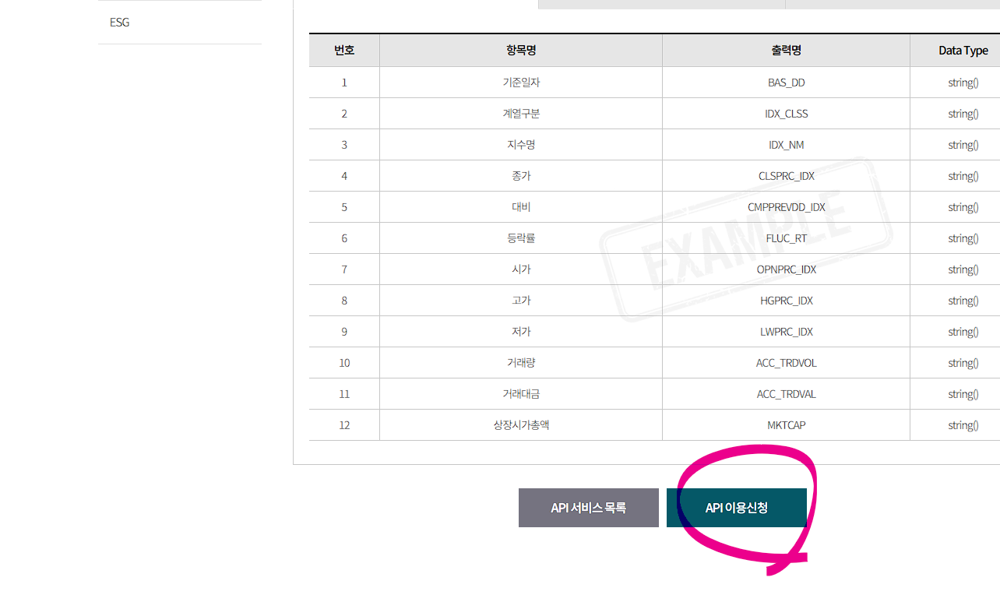
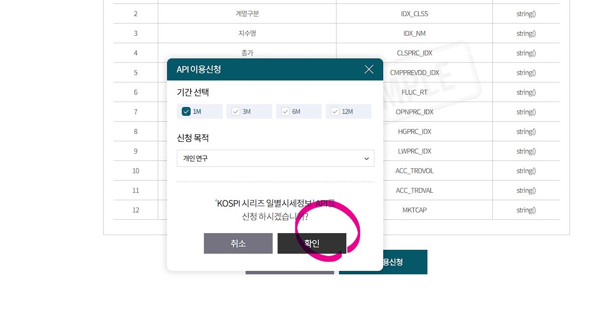
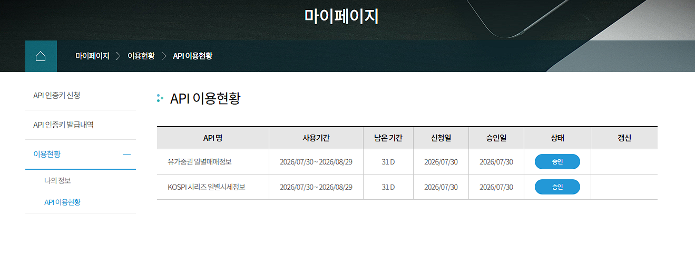

# KRX 일별 시세 조회

KRX OpenAPI에서 승인된 **유가증권 일별매매정보 (`stk_bydd_trd`)**를 조회해 `index.html`에 보여주는 FastAPI 예제입니다. 인증키는 브라우저가 아닌 서버만 읽으므로 화면이나 Git에 노출되지 않습니다.

## 화면

승인된 API와 기준일자를 확인한 후 KOSPI 종목의 종가·등락률·거래량·시가총액을 조회합니다.






## KRX API 이용 승인

KRX OpenAPI의 **API 이용현황**에서 `유가증권 일별매매정보`가 승인 상태인지 확인합니다.




## 실행

```bash
python -m venv .venv
source .venv/bin/activate
pip install fastapi "uvicorn[standard]"
uvicorn main:app --reload
```

같은 컴퓨터에서 실행 중이라면 브라우저에서 `http://127.0.0.1:8000`을 엽니다.

### 원격 환경 또는 컨테이너에서 접속하기

브라우저와 서버가 서로 다른 환경에 있으면 `127.0.0.1`은 브라우저가 실행 중인 컴퓨터를 가리키므로 접속할 수 없습니다. 이 경우 서버를 모든 네트워크 인터페이스에 바인딩하고, 서버의 내부 IP로 접속합니다.

```bash
python3 -m uvicorn main:app --host 0.0.0.0 --port 8000
```

현재 환경의 서버 IP는 `172.29.41.131`이므로 아래 주소를 사용합니다.

```text
http://172.29.41.131:8000/
```

서버 IP는 환경마다 달라질 수 있으며 `hostname -I`로 확인할 수 있습니다. 이 주소는 내부 네트워크용이므로, 외부 인터넷에 공개하려면 방화벽·접근 제어를 별도로 설정해야 합니다.

## 인증키 설정

프로젝트의 `.key` 파일(이미 `.gitignore`에 포함됨)에 키만 한 줄로 넣거나, 아래처럼 환경 변수로 설정합니다.

```bash
export KRX_AUTH_KEY='발급받은_인증키'
```

KRX OpenAPI 사이트에서 `stk_bydd_trd`의 이용신청 및 승인이 완료된 키여야 합니다. 이용기간이 만료되거나 승인이 해제된 경우 KRX는 401/403으로 응답하며, 화면에는 안내가 표시됩니다.

## API

`GET /api/krx/stocks?bas_dd=YYYYMMDD`

KRX 유가증권시장의 종가, 전일 대비, 등락률, 거래량, 시가총액을 반환합니다. KRX API는 장중 실시간 시세가 아니라 일별 매매정보입니다.
